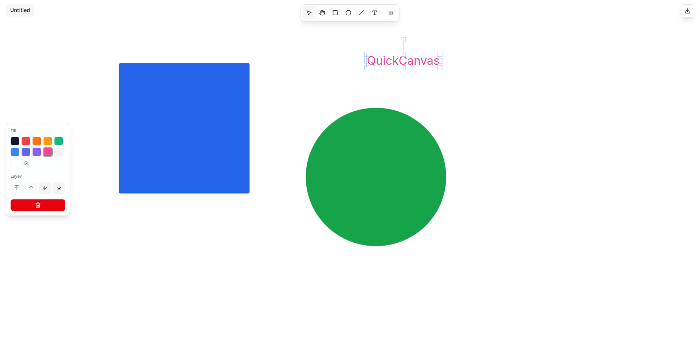

# QuickCanvas



An instantly‑available, client‑side design playground built with Next.js + Fabric.js. Create shapes, paste images/SVG/text, edit fills & corner radii, reorder layers, undo/redo everything, persist multiple documents locally, and export crisp PNGs – all without a backend.

## ✨ Features

- Fast in‑browser canvas powered by Fabric.js 6 (no server required)
- Multi‑document management (create, rename, open, delete, reset)
- Autosave (debounced ~1s after last change) to IndexedDB (Dexie)
- Preview thumbnails & change (dirty) indicator
- Tools: Pointer, Pan/Hand, Rectangle, Ellipse, Line, Text
- Shape creation with drag, plus modifier keys:
	- Shift = constrain aspect (square/circle / snapped line angles)
	- Alt = draw from center
- Rich clipboard integration (system + internal):
	- Paste images (PNG/JPEG etc.) directly (Ctrl/Cmd+V)
	- Paste inline SVG (from design tools or markup)
	- Paste plain text → editable Fabric IText
	- Cut / Copy / Paste selections, objects, images
- Fill color editing
- Rectangle corner radius editing
- Layer ordering: bring forward/backward / to front / to back
- Deletion with undo support (single or multi selection)
- Persistent reusable Resources Gallery with thumbnail previews & checksum dedupe (re‑insert any priorly pasted image/object/selection)
- Undo / Redo (Ctrl/Cmd+Z, Shift+Z / Ctrl+Y) with structured command history (add/remove/modify/reorder/property)
- Keyboard shortcuts mirroring design tools
- Zooming (wheel zoom to cursor; multi‑touch pinch + pan gesture support)
- PNG export (current selection or all objects cropped to bounding box)
- Responsive UI
- Toast notifications (operation feedback, long running paste states)
- Stable hashing of document & gallery payloads (ohash) for change detection & dedupe

## 🧭 Quick Start

Prerequisites: Bun (recommended) or Node.js 18+.

Install dependencies:

```bash
bun install       # or: npm install / pnpm install / yarn install
```

Run the dev server (Turbopack enabled):

```bash
bun dev
```

Visit http://localhost:3000

Build & start production:

```bash
bun run build
bun run start
```

## 🧰 Tech Stack

- Next.js 15 (App Router, React 19)
- Fabric.js 6 (canvas object model & rendering)
- Zustand (central reactive store for tools, selection, gallery, documents)
- Dexie (IndexedDB persistence for documents)
- Radix UI primitives + custom shadcn-style components (dialogs, menus, popovers, toggles, tooltips, scroll area)
- Tailwind CSS v4 (utility styling; `class-variance-authority` + `tailwind-merge` helpers)
- lucide-react (icons)
- sonner (toast notifications)
- ohash (stable structural hashing)
- chroma-js (color manipulation – currently used in picker components)

## 🗂 Folder Overview

```
app/                Next.js App Router entrypoints (layout, page)
components/         UI + canvas controls (toolbar, actions panel, dialogs, gallery)
hooks/              Reusable React hooks (fabric canvas lifecycle & events)
lib/                Utility modules (fabric helpers, history manager, db, colors)
	fabric/           Fabric integration: shapes, selection helpers, export, clipboard
	history/          Command manager (undo/redo abstraction)
	db.ts             Dexie schema + stable hashing adapters
store/              Zustand store (documents, selection, gallery, layer ops)
types/              Type augmentations & canvas tool definitions
public/             Static assets
```

## 🏗 Architecture Highlights

### State & History
- `store/mainStore.ts` centralizes UI + document + selection state.
- Fabric mutations are wrapped with history commands (`commandManager`) recording:
	- Add / Remove objects
	- Modify (transforms, text edits)
	- Reorder (z-index changes)
	- Property mutations (corner radius, fill, etc.)
- Undo/Redo replays serialized object snapshots (with custom `qcId` for stable identity).

### Persistence
- Each document stores a Fabric JSON snapshot plus a stable `contentHash` (derived from object array) to detect changes.
- Preview thumbnails generated by cropping bounding box of visible objects (not full viewport) for clarity.
- Autosave triggers 1s after last dirty mutation; manual Save Now available on mobile.

### Selection Model
- Tracks unified fill + shape-specific properties (e.g., rectangle corner radii) and capability flags that drive conditional UI.
- Editing text temporarily suppresses tool hotkeys / selection changes for a focused experience.

### Gallery System
- Adding objects (including pasted images or multi-selections) stores a normalized payload + PNG preview.
- Normalization strips position offsets & rounds floats → stable content-based checksum for dedupe (bump existing to top instead of duplicating).

### Clipboard & Input
- System clipboard integration attempts image & SVG extraction first, falls back to internal stash if system read blocked.
- Text paste creates editable IText (not automatically added to gallery to avoid clutter).
- Middle-click panning & X11 primary selection paste suppression windows prevent accidental pastes.

### Gestures & Zoom
- Wheel zoom exponential scaling to pointer.
- Multi-touch pinch with viewport transform + two-finger pan.

### Exports
- Selection or full canvas exported via temporary offscreen Fabric canvas, ensuring tight cropping & pixel precision.

## ⌨️ Keyboard Shortcuts

| Action | Shortcut |
|--------|----------|
| Pointer Tool | V / Esc |
| Pan Tool | H or Middle Mouse Drag |
| Rectangle | R |
| Ellipse | E |
| Line | L |
| Text | T |
| Select All | Ctrl/Cmd+A |
| Copy | Ctrl/Cmd+C |
| Cut | Ctrl/Cmd+X |
| Paste | Ctrl/Cmd+V |
| Undo | Ctrl/Cmd+Z |
| Redo | Shift+Ctrl/Cmd+Z or Ctrl/Cmd+Y |
| Delete Selection | Delete / Backspace |

Modifiers during shape drag: Shift = constrain aspect / snap line angle (45° increments), Alt = draw from center.

## 🖼 Export Workflow

1. (Optional) Select objects to export only that subset.
2. Click the Download PNG button (top-right). If a selection exists → `selection.png`; else all objects → `canvas.png`.

## 🔒 Data & Privacy
All data lives locally in your browser’s IndexedDB. No network sync is performed. Clearing site data will remove documents & gallery entries.

## 🧪 Development Notes
- Fabric canvas instance exposed as `window.fabricCanvas` for quick debugging.
- History depth capped (currently 250 commands) – adjust in `commandManager` if needed.

## 🤝 Contributing
Open to enhancements & fixes. Suggested flow:
1. Fork & branch (`feat/your-idea`)
2. Implement + keep patches focused
3. Provide before/after notes or screenshots
4. Open PR

## 📄 License
MIT

## 🙏 Acknowledgements

- Fabric.js for a robust canvas abstraction
- Radix UI & lucide-react for accessible UI primitives & icons
- shadcn/ui for beautiful, customizable component patterns
- Dexie for ergonomic IndexedDB access
- Tailwind CSS for rapid iteration

---

Happy designing! Paste something, tweak it, export it – all instantly.